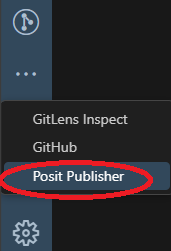
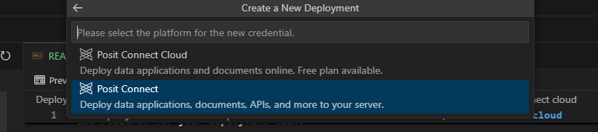

# Deploy your apps
There are some possible places where we can deploy our projects

| Server              | Location         | Description                             |
|---------------------|------------------|-----------------------------------------|
| Posit Connect       | PHS (internal)   | Ask if you have access to Posit Connect |
| Posit Connect Cloud | Posit (external) | PHS currently does not have licenses    |

There are 2 tools to deploy an app but it will depends on your project

| Deployment tool  | Description                                                                                  |
|------------------|----------------------------------------------------------------------------------------------|
| Posit publisher  | Easy UI to deploy R/Python apps. Currently only available in Positron                        |
| rsconnect-python | Commands in terminal to deploy Python apps. It works in VSCode/Positron/RStudio terminal tab |

## Recommendations
Your project should have these features to deploy with no issues regarding packages. Follow these recommendations according to your programming language in order to automatically manage required packages

| Language | Location         | Description                                 |
|----------|------------------|---------------------------------------------|
| R        | renv             | Recommended to have a renv (renv.lock)      |
| Python   | requirements.txt | Recommended to have a requirements.txt file |

## Deployment with Posit publisher extension to Posit Connect/Posit Connect cloud

This option only works for Positron in Posit Workbench. All the steps are done using Posit publisher extension UI. You can only use Positron for your deployment task.

-   Click on the Posit Publisher extension icon. It is on the left hand side bar.



-   Go to deployment tab and click on Select, then click on **Create a New deployment** button.
-   Click on **Select file as your entry point**. Choose your main file (e.g. app.py, app.R, init.qmd). 
-   When asking for **Enther a title for your application**, you can leave default value. Press enter to continue.
-   You will have 2 options to deploy your app.



-   Choose **Posit Connect** as deployment target since we have access to PHS Posit Connect. Cupy and past the PHS Posit Connect URL: `https://pc-prod.publichealthscotland.org/`and press enter to continue.

-   You need to go to Posit connect website, login with your user. Then, click on the user name (right hand side corner), click on Manage your API Keys, click on new API key, select Publisher permissions and click on Generate Key. Don't forget to copy that key.
-   Back in Positron (PWB), choose the API key option for authentication. Copy and paste your API key created in PHS Posit Connect and press enter to continue.
-   Type a unique nickname for this server connection. For example: **mypc** and press enter to continue. You can reuse the same connection for different projects deployment.
-   If the app has already been deployed to PHS Posit Connect (**previously deployed by someone**), go to deployment tab and click on **update that previous deployment**. You should copy the direct link of the app in PHS Posit Connect. It may be something like this: `https://pc-prod.publichealthscotland.org/content/xxxx-xxx-xxxx-xxxx-xxxxxxxxx/` and press enter to continue.
-   You should go to Posit Publisher - Project files section and select the required files for deployment. It is recommended to create a folder content table with **to deploy** column (in your project folder README.md file)
-   (Optional) if your project requires some credentials (e.g. tokens, password) you can use the secrets section. Your R/Python code needs to read those secrets as environment variables.
-   Finally, click on **Deploy your Project** button.
-   There are folders created as logs (part of the deployment session). They are useful to quickly and easily re deploy our projects. For example, if we have some updates to do, we only need to click on **Deploy your Project**

## Folders created in your current project folder
We can delete these folders but we will need to follow the previous steps to deploy again.

| Deployment tool  | Folder           |
|------------------|------------------|
| Posit publisher  | .posit           |
| rsconnect-python | rsconnect-python |

## Exclude deployment folders

If your project is on GitHub you should add these folders to the .gitignore file:

```text
.posit
rsconnect-python
```
