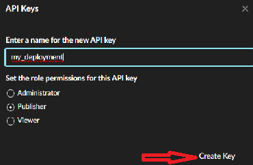
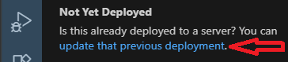
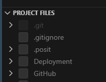
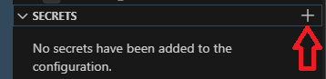

# Deploy your apps

There are several places where we can deploy our projects.

| Server | Location | Description |
|--------------------|-------------------|---------------------------------|
| Posit Connect | PHS (internal) | Ask if you have access to Posit Connect |
| Posit Connect Cloud | Posit (external) | PHS currently does not have licenses |

There are two deployment tools, but the best option depends on your project.

| Deployment tool | Description |
|--------------------------|----------------------------------------------|
| Posit Publisher | Easy UI to deploy R/Python apps. Currently only available in Positron |
| rsconnect-python | Command-line tools to deploy Python apps. Works in VS Code, Positron, and RStudio terminal tabs |

## Recommendations

Your project should have these features to deploy without issues regarding packages. Follow these recommendations according to your programming language to automatically manage required packages.

| Language | Location         | Description                                 |
|----------|------------------|---------------------------------------------|
| R        | renv             | Recommended to have a renv (renv.lock)      |
| Python   | requirements.txt | Recommended to have a requirements.txt file |

## Deployment with Posit Publisher extension to Posit Connect / Posit Connect Cloud

This option only works with Positron in Posit Workbench. All steps are performed through the Posit Publisher extension UI. You can only use Positron for deployment tasks.

- Click the Posit Publisher extension icon in the left-hand sidebar.


- Go to the Deployment tab and click **Select**, then click **Create a New deployment**.
- Click **Select file as your entry point**. Choose your main file (for example, `app.py`, `app.R`, or `init.qmd`).
- When asked to **Enter a title for your application**, you can leave the default value and press Enter.
- You will see two options to deploy your app.


- Choose **Posit Connect** as the deployment target since we have access to PHS Posit Connect. Copy and paste the PHS Posit Connect URL: `https://pc-prod.publichealthscotland.org/` and press Enter.

- Go to the Posit Connect website and sign in with your account. Then click your username in the top-right corner and select *Manage Your API Keys*. Click *New API Key*, choose *Publisher* permissions, and click *Generate Key*. Be sure to copy the generated API key.



- Back in Positron (PWB), choose the API key authentication option. Paste the API key you created in PHS Posit Connect, then press Enter.

- Enter a unique nickname for this server connection (for example, `mypc`) and press Enter. You can reuse the same connection for deployments across different projects.

- If the app has already been deployed to PHS Posit Connect (previously deployed by someone else), go to the Deployment tab and click **Update that previous deployment**. Copy the app's direct URL from PHS Posit Connect (for example, `https://pc-prod.publichealthscotland.org/content/xxxx-xxx-xxxx-xxxx-xxxxxxxxx/`), paste it, and press Enter.



- Go to the *Posit Publisher* → *Project Files* section and select the files required for deployment. It is recommended to include a table with a "Deploy" column in your project's `README.md` file to help identify which files should be deployed.



- (Optional) If your project requires credentials, such as tokens or passwords, store them in the *Secrets* section. Your R/Python code should access these secrets through environment variables.



- Finally, click the *Deploy Your Project* button.

Note: As part of the deployment process, log folders are created. These can be used to simplify future deployments. For example, if you update the project, you can redeploy it by simply clicking the *Deploy Your Project* button.

## Log folders created as part of the deployment process

These folders can be deleted, but you will need to repeat the previous deployment steps.

| Deployment tool  | Folder           |
|------------------|------------------|
| Posit Publisher  | .posit           |
| rsconnect-python | rsconnect-python |

## Exclude unnecessary folders/files when deploying an app

It is important not to deploy unnecessary folders/files. For example:

| Folder |   |
|-------------------------------------------|-----------------------------|
| .posit and rsconnect-python | There is no need to deploy these deployment log folders. |
| .env and renv folders | There is no need to deploy Python or R virtual environments, as they are automatically created during the first deployment. |
| .env file | This settings file does not need to be deployed, as Posit Publisher provides a *Secrets* section for storing sensitive data. |
| README.md | This is not needed, as it is mainly intended for GitHub or for use as a guide or tutorial. |
| LICENSE | This is not needed, as it is primarily intended for use with GitHub. |
| .gitignore | This is not needed, as it is only required on GitHub. |

You can always ask for advice.

## Exclude deployment folders on GitHub

If your project is on GitHub, add these folders to the `.gitignore` file:

```text
.posit
rsconnect-python
```

## Troubleshooting

- If Posit Publisher cannot detect your previously deployed `.posit` folder, close the current session and start a new one.
