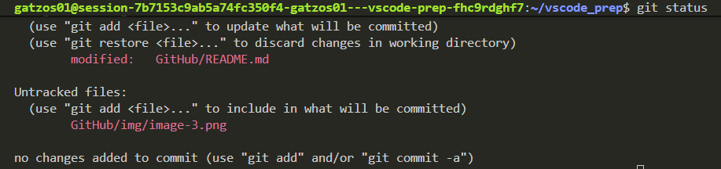
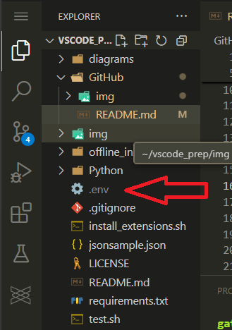
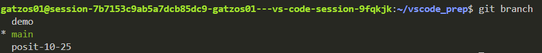
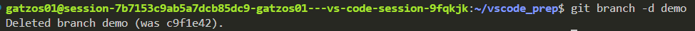
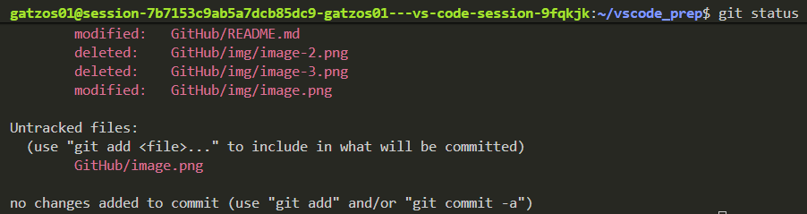

# How to use GitHub on vs code
There are ways to connect to GitHub. You can use HTTPS or SSH. If a repo is public you can quickly clone a repo using git clone https... but if this repo is not public you will need to setup SSH. If you already setup SSH in R studio you don't need to do it again.

## How to setup SSH by terminal
- Open a terminal and run the following command: `bash GitHub/setup_github_ssh_min.sh -e "your_email_registed_on_your_github_account" -n -f`
- Follow the instructions showed in terminal
- You can check if your SSH is working, run this command: `ssh -T git@github.com`
- You will see a message in terminal like: **Hi username! You've successfully authenticated, but GitHub does not provide shell access.**

## Common commands in terminal
If you are working in a project which already is on GitHub. Follow these steps:

- Open a terminal (if it isn't already open)
- If you want to check which files have changed, run this command: `git status`

- You can add all your changes using this command: `git add .`
- It's time to create your commit, use this command: `git commit -m "your_message"`
- Finally, you can push those changes to your repo using, don't forget the branch name: `git push origin branch_name`

Note: Files/folders listed in .gitignore will have a gray colour in your Explorer section and they will stay there no matter which branch you create/move. (.e.g .env file):

## Other important GitHub commands.
- If you want to create a new branch: `git checkout -b demo`
- If you want to move to another branch (e.g. back to main):` git checkout main`
- If you want to list branches you copied in your local folder, the asteric indicates your current branch: `git branch`

- If you want to locally delete a branch, don't forget to move to another branch before deletion: `git branch -d demo`

- If you want to list changes in the current branch: `git status`

- If you want to restore a file, you can use the listed changes from git status command to copy file path. For example I will restore README.md file from GitHub folder: `git restore GitHub/README.md`

## If you transfer a repo from your account to an organisation account
- Use this command in terminal to check the current url in your local folder: `git remote -v`
- If you see origin  https://github.com... it means it was cloned using HTTPS
- Copy the URL from the organisation repo
- Run this command in terminal to set the new orgnaisation github repo: `git remote set-url origin https://github.com/<your_org>/<repo_name>.git`
- You can see the changes if you run this command again: `git remote -v`
