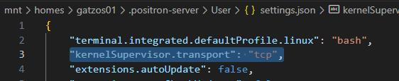

# Positron in Posit workbench

This file describes the Positron IDE (2025.08.1 build 11) available in the Posit workbench environment. Positron is a lightweight IDE designed for R programming, providing essential features for coding, debugging, and project management. It also supports Python and other languages through extensions.

## Restrictions

🔴**Ai Assistants**: PHS users are **not allowed** to integrate any AI assistance (GitHub copilot/Claude) in Positron for just now.

## How can I install extensions in Positron?

You can follow the same steps available in the main README.md file.

## How to solve Console HTTP error in Positron?

If you encounter an HTTP error in the Positron console, try the following steps (workaround) to resolve it:

-   Open a Positron session
-   Press ctrl + shift + p and type user settings json
-   Click on Preferences: Open User Setting (JSON)
-   Add this line in the JSON flie: "kernelSupervisor.transport": "tcp",

-   Save the file using ctrl + s
-   Press again ctrl + shift + p and type reload window
-   Click on Developer: Reload Window
-   You can see your console tab is working now.

## Can I open projects created in RStudio in Positron?
Yes, you can open projects created in RStudio in Positron. Simply navigate to the project directory and open it in Positron. The IDE will recognize the project structure and settings.