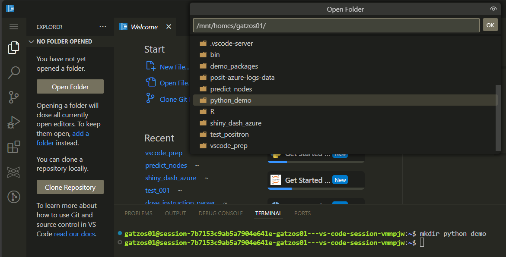
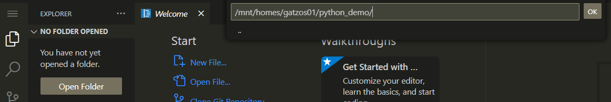
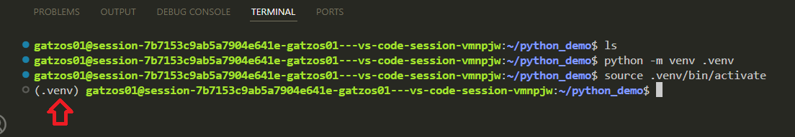
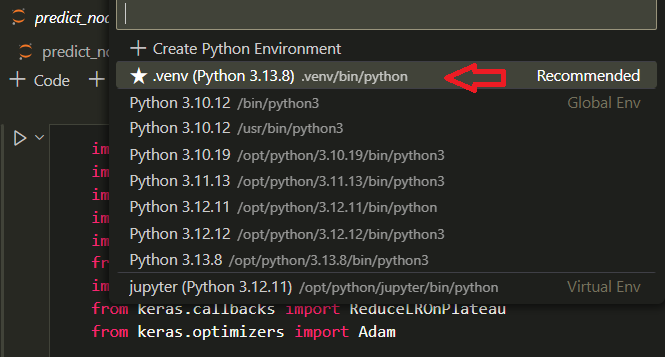

# Python
You can run Python code in VS code and Positron. They could be in .py files or Jupyter Notebooks (.ipynb).

## Python venv creation
You can use venv (similar to renv in R) to create environments (private package container). 
- If you cloned vscode_prep, you should close vscode_prep and start from the main user path.

- You can create as many venv as you need and It depends on your Python version needs. 
- You can create inside your Python project or outside
- Best practice says it is good to create one venv per project
- Open a vscode session in Posit Workbench
- Open a terminal on vscode (ctrl + shift + ')
- Create a folder for your new project (e.g python_demo). Use the following command in your terminal:
```
mkdir python_demo
```
- Then you have to open your project folder using vs code/Positron. Go to the left hand menu and click on the explorer. You will see an Open Folder button. Click that button and you will see a dropdown list. You can click on your project folder (python_demo)

- You will see the complete path of your project folder and an OK button, click OK

- You will be in your project folder ready to work.
- You can choose one of these commands depending on your Python version need:

| Python Version | Command (virtual env outside Project Folder)                         | Command (Internal Project Folder)               |
|----------------|----------------------------------------------------------------------|-------------------------------------------------|
| 3.13.8         | `python -m venv /mnt/homes/your_user/.venv`                          | `python -m venv .venv`                          |
| 3.12.12        | `/opt/python/3.12.12/bin/python3 -m venv /mnt/homes/your_user/.venv` | `/opt/python/3.12.12/bin/python3 -m venv .venv` |
| 3.11.13        | `/opt/python/3.11.13/bin/python3 -m venv /mnt/homes/your_user/.venv` | `/opt/python/3.11.13/bin/python3 -m venv .venv` | 
| 3.10.19        | `/opt/python/3.10.19/bin/python3 -m venv /mnt/homes/your_user/.venv` | `/opt/python/3.10.19/bin/python3 -m venv .venv` | 

- This command will create an environment called .venv
- It is important to know Python versions end of support: https://devguide.python.org/versions/
- It's time to activate your personal virtual environment (venv). You need to activate it through the terminal. Open a terminal (Ctrl + Shift + `) if there isn’t one at the bottom of the VS Code/Positron interface.
- You need to remember you venv folder name, run one of these commands to activate it: 

| Command (virtual env outside Project Folder)     | Command (Internal Project Folder) |
|--------------------------------------------------|-----------------------------------|
| `source /mnt/homes/your_user/.venv/bin/activate` | `source .venv/bin/activate`       |
- You will see .venv as part of the terminal line


- You need to update your pip (Python package manager) which helps to download new packages: `pip install --upgrade pip wheel`
- You have 2 options to install required packages (make sure your python environment is already activated). Best practice says it is important to have requirements.txt file in every Python project folder.
- Create a requirements.txt file in your python_demo folder
- Option 1: Using a requirements.txt to facilitate the process: `pip install -r requirements.txt --prefer-binary`
- Option 2: Installing one package at time using the command in terminal: `pip install pandas==2.3.3 --prefer-binary`
    
    Note: If you don't activate your python environment you will probably install your package in the main Python installation.
    
- It is important to know packages versions for compatibility purposes, who develops this package (trusted sources) and how frequent they are updated: https://pypi.org/
- You should refresh your IDE to make sure your venv has been detected. Press ctrl + shift + p and search Developer reload window

### If you installed juputerlab in your own environment
- When you work with jupyter notebooks (.ipynb), make sure to click on the select kernel (dropdown right hand side) and choose your environment name.

- Click on Python environments

- Select your local .venv (in this case the project folder environment)

- If your project only have (.py) Python scripts, make sure to select the proper interpreter. Press ctrl + shift + p and search Python select interpreter

### Python packages in requirements.txt
These packages are the most popular and you can customise your own **requirements.tx**t file depending on your project needs.
- python-dotenv is useful when you want to separate sensitive data like usernames, password and others
- pandas is useful for data manipulation (dataframes)
- plotly is powerfull for data visualisation (bar, line and other plots)
- scikit-learn is useful for machine learning models (decision tree, random forest, support vector machine and others)
- pillow is needed when working with images
- jupyterlab is needed when working with Jupyter notebooks

You can install more packages later. For example:
- geopandas is powerfull when working with maps
- polars is faster than Pandas for large datasets
- ipywidgets helps to create controls in jupyter notebooks like dropdownlists, radio buttons, buttons and others
- duckdb is a powerfull embedded database for analytical purposes
- tensorflow is very popular for neural networks (deep learning)

### Alternative conda environments - only if you need it
- Use your vscode or R studio terminal to download miniconda: `wget -P /mnt/homes/your_user/ https://repo.anaconda.com/miniconda/Miniconda3-latest-Linux-x86_64.sh`
- Give execution permission to the script: `chmod +x /mnt/homes/your_user/Miniconda3-latest-Linux-x86_64.sh`
- Run the script file (Follow the installation steps): `bash /mnt/homes/your_user/Miniconda3-latest-Linux-x86_64.sh`
- Activate your base conda: `source /mnt/homes/your_user/miniconda3/bin/activate `
- You will be able to create your conda environment (you can directly add packages to the creation command). This command creates a conda environment called envtest: `conda create -n envtest python=3.11.9 pandas=2.2.3` or `conda create -n envtest python=3.11.9`
- You should activate your env (one of them). You will see your env name between parentheses: `conda activate envtest`
- You can install more packages (Your conda env must be activated): `conda install pandas=2.2.3`
- Check your packages: `conda list`
- You can use pip for packages which are not available via conda. You need to know your conda environment path using this command: `conda env list`
- You need to use your conda environment path like this: `/mnt/homes/your_user/miniconda3/envs/envtest/bin/pip install package_name==package_version`
- it would be similar if you want to run a py script in this specific conda environment. If your script is called demo.py you can use the following command: `/mnt/homes/your_user/miniconda3/envs/envtest/bin/python project_path/demo.py`

## 7 common Python mistakes we should avoid in production code:
- Type Hints
```python
# Mistake:
def add(x, y):
    return x + y
# Fix:
def add(x: int, y: int) -> int:
    return x + y
```
Comment: Functions become harder to understand, refactor, or use Without type hints. Type hints make code self-documenting and are a gateway to tools like mypy and better IDE support.
- Using Mutable Default Arguments
```python
# Mistake:
def append_item(item, items=[]):
    items.append(item)
    return items`
# Fix:
`def append_item(item, items=None):
    if items is None:
        items = []
    items.append(item)
    return items
```
Comment: The default list is shared across all function calls. This leads to odd behavior and hard-to-trace bugs. So, avoid mutable default arguments unless you really know what you’re doing.
- Overusing List Comprehensions
```python
# Mistake:
result = [transform(x) for x in some_large_iterable if condition(x)]
# Fix:
for x in some_large_iterable:
    if condition(x):
        yield transform(x)
```
Comment: List comprehensions are elegant, but they can become unreadable or memory-intensive with complex logic or large data sets. Use regular loops when readability or memory is a concern.
- Catching Bare Exceptions
```python
# Mistake:
try:
    do_something()
except:
    handle_error()
# Fix:
try:
    do_something()
except ValueError as e:
    handle_value_error(e)
```
Comment: Catching all exceptions (KeyboardInterrupt, SystemExit, and MemoryError) can hide serious problems and make debugging difficult. Be specific in your exception handling. It makes code safer and easier to debug.
- Misusing print
```python
# Mistake:
print("Something went wrong")
# Fix:
import logging

logging.basicConfig(level=logging.INFO)
logger = logging.getLogger(__name__)
logger.info("Something went wrong")
```
Comment: print is fine for debugging but useless in a real-world environment where logs matter. Logging is your best friend in production. Use it early and often.
- Monolithic Functions
```python
# Mistake:
def process_data():
    # 50+ lines doing many things
# Fix:
def fetch_data(): ...
def clean_data(): ...
def transform_data(): ...
def save_data(): ...
```
Comment: Monolithic functions are hard to test, debug, and maintain. Break down functionality into smaller, reusable functions.

## Test package installation speed
- Run installing_on_linux.sh to test package installation speed on Linux.
- Run installing_on_windows.bat to test package installation speed on Windows.