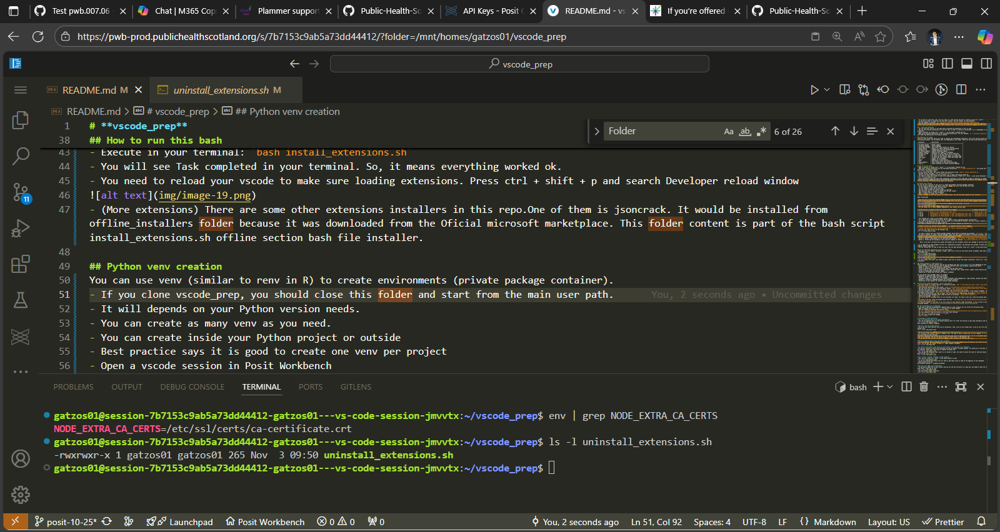
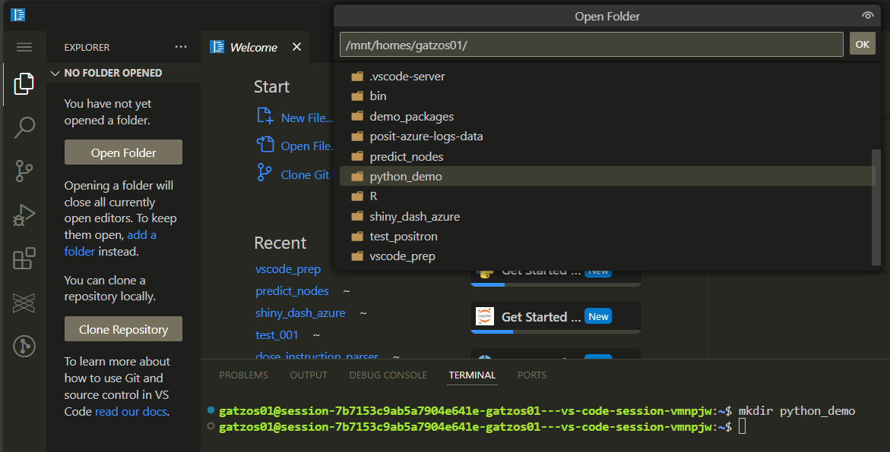
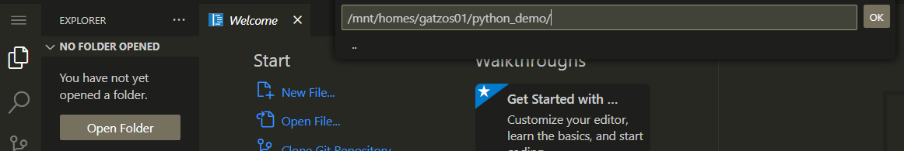
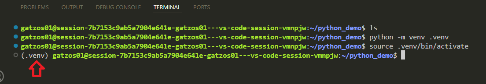
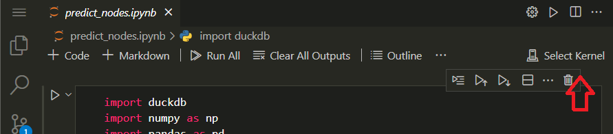
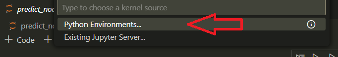
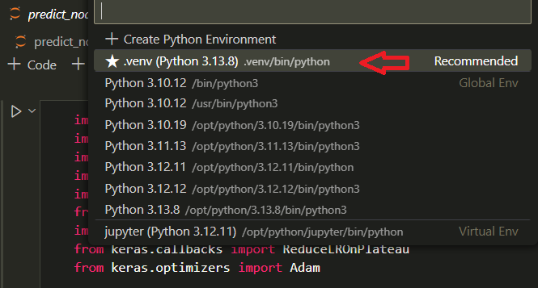

# Python
You can run Python code in VS Code and Positron. Your code can be in .py files or in Jupyter Notebooks (.ipynb)

## Create your own Python virtual environment (venv)
You can use venv, which works like renv in R, to create isolated environments for your packages. It’s best practice since different projects often depend on different package versions.

- If you cloned vscode_prep, you should close vscode_prep and start from the main user path.

- You can create as many venv as you need and It depends on your Python version needs. 
- You can create inside your Python project (best practice) or outside (to use one venv for many projects)
- Open a vscode/Positron session in Posit Workbench
- Open a terminal on vscode/Positron (ctrl + shift + ')
- Create a folder for your new project (e.g python_demo). Use the following command in your terminal:
```
mkdir python_demo
```
- Then you have to open your project folder using vscode/Positron. Go to the left hand menu and click on the explorer. You will see an Open Folder button. Click that button and you will see a dropdown list. You can click on your project folder (python_demo)

- You will see the complete path of your project folder and an OK button, click OK

- You will be in your project folder ready to work.
- There is a newer Python package manager called UV (modern, faster and lighter). Check if it is available using this command in terminal: `uv --version`
- If UV is available in your session, it means you have two options for creating virtual environments. I recommend UV because it installs packages faster and uses less space than classic pip.
- You can choose one of these commands depending on the Python version you need. Many projects use .venv (including the dot) as the standard convention for Python virtual environment folders.

| Python  | UV (inside your project)                                 | Classic PIP (inside your project)               |
|---------|----------------------------------------------------------|-------------------------------------------------|
| 3.14.4  | `uv venv .venv`                                          | `python -m venv .venv`                          |
| 3.13.13 | `uv venv --python /opt/python/3.13.13/bin/python3 .venv` | `/opt/python/3.13.13/bin/python3 -m venv .venv` |
| 3.12.13 | `uv venv --python /opt/python/3.12.13/bin/python3 .venv` | `/opt/python/3.12.13/bin/python3 -m venv .venv` |
| 3.11.15 | `uv venv --python /opt/python/3.11.15/bin/python3 .venv` | `/opt/python/3.11.15/bin/python3 -m venv .venv` | 

* Why is the Python 3.14.x command shorter and doesn’t require the --python argument? Because Python 3.14 is set as the default interpreter in this Posit Workbench environment.
* How do I create a global virtual environment? Simply replace .venv with an absolute path, for example: uv venv --python /opt/python/3.x.x/bin/python3 /mnt/homes/your_user/.venv

- It is important to know Python versions end of support: https://devguide.python.org/versions/
- It's time to activate your virtual environment (.venv). You need to activate it through the terminal. Open a terminal (Ctrl + Shift + `) if there isn’t one at the bottom of the VS Code/Positron interface.
- You need to remember your virtual environment folder name (or its location if it’s a global one). Then run one of these commands to activate it (same for UV and classic pip):

| Inside your Project         | Outside your project                             |
|-----------------------------|--------------------------------------------------|
| `source .venv/bin/activate` | `source /mnt/homes/your_user/.venv/bin/activate` |

- You will see .venv as part of the terminal line


- It’s time to install some Python packages. You can install them from a requirements.txt file (best practice) or install them individually. 
- Create your requirements.txt file (there’s one in this repo you can use as a reference)
- Let’s compare the steps between UV and classic pip

| uv steps                                                               | pip steps                                                                           |
|------------------------------------------------------------------------|-------------------------------------------------------------------------------------|
| 1. No need to update pip neither install wheel                         | 1. Update pip and install wheel package: `pip install --upgrade pip wheel`          |
| 2. Install from requirements.txt: `uv pip install -r requirements.txt` | 2. Install from requirements.txt: `pip install -r requirements.txt --prefer-binary` |
| 3. Optionally per package: `uv pip install pandas==2.3.3`              | 3. Optionally per package: `pip install pandas==2.3.3 --prefer-binary`              |
    
    Note: If you don’t activate your Python environment, you will probably install the package into the default global Python installation.
    
- It’s important to know the package versions for compatibility purposes, who maintains the package (to ensure it comes from a trusted source), and how frequently it is updated: https://pypi.org/
- You should refresh your IDE to make sure your venv has been detected. Press ctrl + shift + p and search Developer reload window

### Python packages in requirements.txt
These packages are the most popular and you can customise your own **requirements.tx**t file depending on your project needs.
- python-dotenv is useful when you want to separate sensitive data like usernames, password and others
- pandas is useful for data manipulation (dataframes)
- plotly is powerfull for data visualisation (bar, line and other plots)
- scikit-learn is useful for machine learning models (decision tree, random forest, support vector machine and others)
- pillow is needed when working with images
- ipykernel is needed to run cells in a Jupyter notebooks
- jupyter-client is needed to see graphs in a Jupyter notebooks
- nbformat is needed to read and write Jupyter notebooks
- nbconvert is needed to convert Jupyter notebooks to other formats like HTML.

**Notes**
* You can open Jupyter Notebook files in Positron or VS Code using the appropriate extensions. These IDEs are optimized to offer a better overall development experience.
* If your project has jupyter notebook files, you only need ipykernel, jupyter-client, nbformat and nbconvert. You don’t need to install large tools such as JupyterLab or Conda, since Positron and VS Code already handle many of those features.
* If you project is a Python quarto one, you only need need ipykernel, pyyaml, nbformat and nbconvert.
* Install and keep track of **only needed packages**. This will save space, which is an important PHS resource

You can install more packages later. For example:
- geopandas is powerfull when working with maps
- polars is faster than Pandas for large datasets
- ipywidgets helps to create controls in jupyter notebooks like dropdownlists, radio buttons, buttons and others
- duckdb is a powerfull embedded database for analytical purposes
- shiny is a framework that lets you build interactive web applications and dashboards
- tensorflow is very popular for neural networks (deep learning)

### Working with jupyter notebook files in your own environment
- When you work with jupyter notebooks (.ipynb), make sure to click on the select kernel (dropdown right hand side) and choose your environment name.

- Click on Python environments

- Select your local .venv (in this case the project folder environment)

- If your project only have (.py) Python scripts, make sure to select the proper interpreter. Press ctrl + shift + p and search Python select interpreter

### Other Python related content

| Topic                     | Location                                                   | Description                                         |
|---------------------------|------------------------------------------------------------|-----------------------------------------------------|
| coding tips               | [View coding tips README](./tips/README.md)                | Best practices when coding                          |
| conda environments        | [View conda environments README](./conda/README.md)        | For those projects which need conda env             |
| package installation test | [View package installation test README](./tests/README.md) | Test Python package installation performance in PHS |


### Python projects examples

[Python project which connects to DENODO/SMRA](https://github.com/Public-Health-Scotland/python_demo_databases)
[Quarto Python project](https://github.com/Public-Health-Scotland/test_python_quarto)
[Python shiny project](https://github.com/Public-Health-Scotland/shiny_python_demo)
[Video Presentation about Python](https://vimeo.com/1140086541?fl=pl&fe=cm&turnstile=0.xdowXcokErMFPTekHdNyHbwF63VqhVbGv5zMRUgQn21T0LgEvDXJ-7A35PgvWNvOstleqivL4-v70EGTg8TIz9ZKHB4gfmsm745o0keJODFEPCRM1AbzyORmdeVC4wOPrGzv8fFgTaCXgiL3hOxBcsdOjdtnBEqCR557qMGxZylCQyweqgMntU-pmXg2nZJsSMOKLnlxpwndVYXoLqUyudkeIBoBAZivfwHzWu29x7k1yhC4I-z269J8x2KLwbT256tvteOiUFmSI-EOMb-gN3kkeekDeONuOop_DXUOUY8tTHxvcvrXzUjgooQC507ii3ja0x04NxygLzkYPM6pP5BSUeMEsl_dkCAMbs0SoQ-oG5w9EiNefiIsJZ-4PktEB3-bY63x3j9hud-x-Ht-9JTRN2X7aFzNj4x8SBQ_fGs22mqZiyCd2jXZV-oHyYm_XFAhjvqsZ1ZrnW1JQvwk5qtoddtaFwrhbQYtZE9CkHXNNNJKEiGBdOb-H4sx7N3_tSfwIxyR358Lbml85UQER09IwkyDqD-a_OuNGZokNVtF_B-WzA3po9ZrBut3g_e9hA5I4ZBMBrmYbmJyqZy8iUinGbpyK30UVBTi0jAWUfxU5N5EM4hEi4e-r0Tuxm5G1XqLiz6od5BFUhoKyKSC0ZayKOWJ4PA6wL39elNHLlDVuhAlKNmWw96_7AJHeqX3WxVY_G29pg2P8IGEoKUvfic9JF5LOFPAiOtJVFRJjpsyoYlScctNVlpt8vcX6jEnwWWVIdhFJxSUzQh9qfcAI43kEyhtRN2gJ2qbuV_Gp0o6PtYUvCQ1GTAF5NfyJ-XTJTA-p1exkoi390ziCf4_8-3YjSXMe3p2lzDmNtuAhlXqNBF6chH_qVnVA7002BwwE0f26Nh-fp-Yew4MA5eC5u0pm2qMfq6uV2jpRP5WzLIBpOgJq0uBx-NmzALZa5s5i6Y5id9EsU20iLwLeXpVkQ.XGJDILJLuxDYCQiobRjn1A.74a9e5b88d2b607ff3059272a1d2a760b85a29f79532f4c2782fe7fc80bf25fe)
