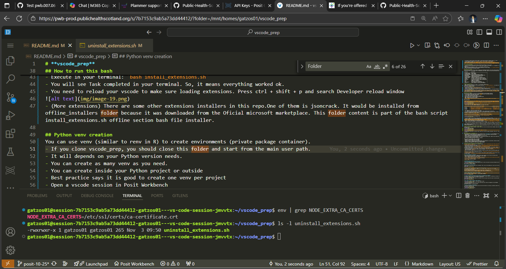
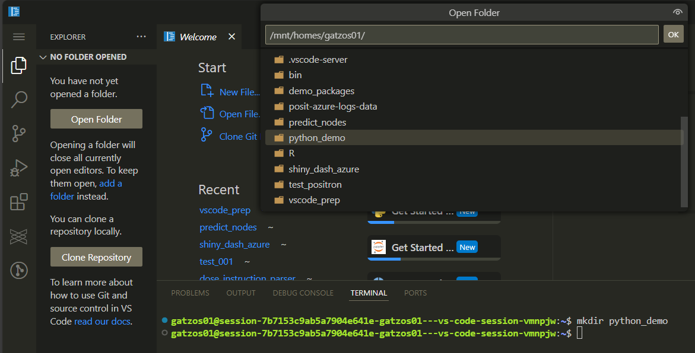
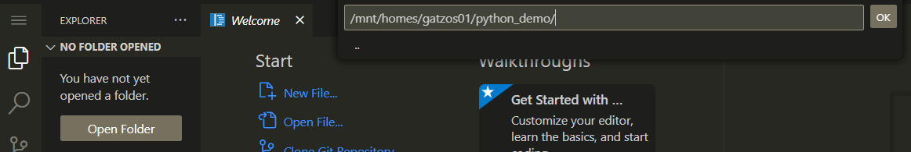
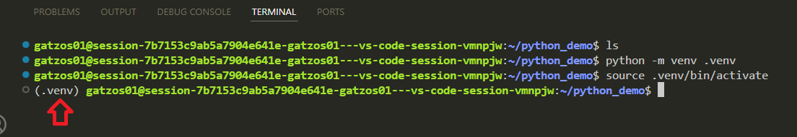
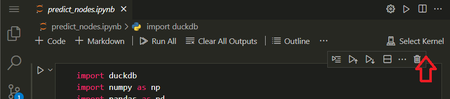
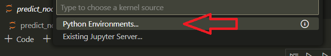
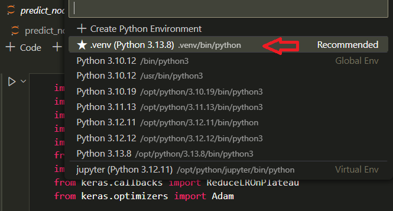

# Python
You can run Python code in VS code and Positron. They could be in .py files or Jupyter Notebooks (.ipynb).

## Python venv creation
You can use venv (similar to renv in R) to create environments (private package container). 
- If you cloned vscode_prep, you should close vscode_prep and start from the main user path.

- You can create as many venv as you need and It depends on your Python version needs. 
- You can create inside your Python project or outside
- Best practice says it is good to create one venv per project
- Open a vscode session in Posit Workbench
- Open a terminal on vscode (ctrl + shift + ')
- Create a folder for your new project (e.g python_demo). Use the following command in your terminal:
```
mkdir python_demo
```
- Then you have to open your project folder using vs code/Positron. Go to the left hand menu and click on the explorer. You will see an Open Folder button. Click that button and you will see a dropdown list. You can click on your project folder (python_demo)

- You will see the complete path of your project folder and an OK button, click OK

- You will be in your project folder ready to work.
- You can choose one of these commands depending on your Python version need:

| Python Version | Command (virtual env outside Project Folder)                         | Command (Internal Project Folder)               |
|----------------|----------------------------------------------------------------------|-------------------------------------------------|
| 3.13.8         | `python -m venv /mnt/homes/your_user/.venv`                          | `python -m venv .venv`                          |
| 3.12.12        | `/opt/python/3.12.12/bin/python3 -m venv /mnt/homes/your_user/.venv` | `/opt/python/3.12.12/bin/python3 -m venv .venv` |
| 3.11.13        | `/opt/python/3.11.13/bin/python3 -m venv /mnt/homes/your_user/.venv` | `/opt/python/3.11.13/bin/python3 -m venv .venv` | 
| 3.10.19        | `/opt/python/3.10.19/bin/python3 -m venv /mnt/homes/your_user/.venv` | `/opt/python/3.10.19/bin/python3 -m venv .venv` | 

- This command will create an environment called .venv
- It is important to know Python versions end of support: https://devguide.python.org/versions/
- It's time to activate your personal virtual environment (venv). You need to activate it through the terminal. Open a terminal (Ctrl + Shift + `) if there isn’t one at the bottom of the VS Code/Positron interface.
- You need to remember you venv folder name, run one of these commands to activate it: 

| Command (virtual env outside Project Folder)     | Command (Internal Project Folder) |
|--------------------------------------------------|-----------------------------------|
| `source /mnt/homes/your_user/.venv/bin/activate` | `source .venv/bin/activate`       |
- You will see .venv as part of the terminal line


- You need to update your pip (Python package manager) which helps to download new packages: `pip install --upgrade pip wheel`
- You have 2 options to install required packages (make sure your python environment is already activated). Best practice says it is important to have requirements.txt file in every Python project folder.
- Create a requirements.txt file in your python_demo folder
- Option 1: Using a requirements.txt to facilitate the process: `pip install -r requirements.txt --prefer-binary`
- Option 2: Installing one package at time using the command in terminal: `pip install pandas==2.3.3 --prefer-binary`
    
    Note: If you don't activate your python environment you will probably install your package in the main Python installation.
    
- It is important to know packages versions for compatibility purposes, who develops this package (trusted sources) and how frequent they are updated: https://pypi.org/
- You should refresh your IDE to make sure your venv has been detected. Press ctrl + shift + p and search Developer reload window

### If you installed jupyterlab in your own environment
- When you work with jupyter notebooks (.ipynb), make sure to click on the select kernel (dropdown right hand side) and choose your environment name.

- Click on Python environments

- Select your local .venv (in this case the project folder environment)

- If your project only have (.py) Python scripts, make sure to select the proper interpreter. Press ctrl + shift + p and search Python select interpreter

### Python packages in requirements.txt
These packages are the most popular and you can customise your own **requirements.tx**t file depending on your project needs.
- python-dotenv is useful when you want to separate sensitive data like usernames, password and others
- pandas is useful for data manipulation (dataframes)
- plotly is powerfull for data visualisation (bar, line and other plots)
- scikit-learn is useful for machine learning models (decision tree, random forest, support vector machine and others)
- pillow is needed when working with images
- ipykernel is needed to run cells in a Jupyter notebooks
- jupyter-client is needed to see graphs in a Jupyter notebooks
- nbformat is needed to read and write Jupyter notebooks
- nbconvert is needed to convert Jupyter notebooks to other formats like HTML.

You can install more packages later. For example:
- geopandas is powerfull when working with maps
- polars is faster than Pandas for large datasets
- ipywidgets helps to create controls in jupyter notebooks like dropdownlists, radio buttons, buttons and others
- duckdb is a powerfull embedded database for analytical purposes
- tensorflow is very popular for neural networks (deep learning)

### Working with jupyter notebook files in your own environment
- When you work with jupyter notebooks (.ipynb), make sure to click on the select kernel (dropdown right hand side) and choose your environment name.
- Click on Python environments
- Select your local .venv (in this case the project folder environment)
- If your project only have (.py) Python scripts, make sure to select the proper interpreter. Press ctrl + shift + p and search Python select interpreter

### Other Python related content

| Topic                     | Location                                                   | Description                                         |
|---------------------------|------------------------------------------------------------|-----------------------------------------------------|
| coding tips               | [View coding tips README](./tips/README.md)                | Best practices when coding                          |
| conda environments        | [View conda environments README](./conda/README.md)        | For those projects which need conda env             |
| package installation test | [View package installation test README](./tests/README.md) | Test Python package installation performance in PHS |


### Python projects examples

- [Python project which connects to DENODO/SMRA](https://github.com/Public-Health-Scotland/python_demo_databases)

- [Quarto Python project](https://github.com/Public-Health-Scotland/test_python_quarto)

- [Python shiny project](https://github.com/Public-Health-Scotland/shiny_python_demo)

- [Video Presentation about Python](https://vimeo.com/1140086541)