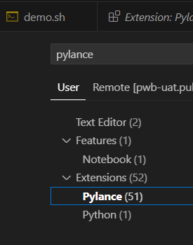
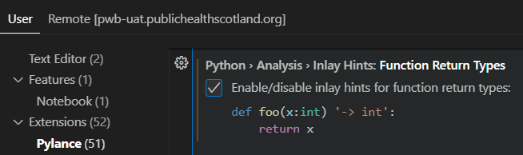
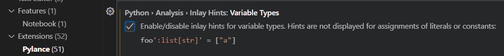
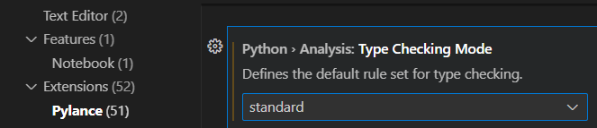

# **vscode_prep**
This repo helps to prepare your vscode (Python and/or R) in the new Posit.

## Extensions for vscode
There are some extensions which will help to improve your development experience. The script called “install_extensions.sh” will automate the installation process. You can modify this file depending on your needs. These are the most used extensions you can find in the script:
- ms-python.python: Python support
- ms-python.debugpy: Python debbuger
- autodocstring: autogenerate functions documentation
- ms-toolsai.jupyter: Jupyter Notebooks support
- jupyter-renderers: improves plot support in notebooks
- vscode-icons-team: It improves vscode icons for files in a friendly way
- prettier-vscode: Formatter for many type of scripts
- rainbow-csv: It helps to see your CSV files in a nicer way
- gitlens: It gives you more details about you GitHub repo
- code-runner: Powerfull tool to run chunks of code
- anaconda-extension-pack: Extension for conda environments
- r: Support for R language
- shiny: Support for shiny projects
- autopep8: Formatter specifically for Python

## How to run this bash
- Open a terminal on vscode (ctrl + shift + ') if you haven't opened one yet.
- Make shure “install_extensions.sh” has executable permissions (`ls -l /mnt/homes/your_user/vscode_prep/install_extensions.sh)`. You should see "x" on the left hand side.

- If you cannot see the x you should change the permissions using `chmod +x /mnt/homes/your_user/vscode_prep/install_extensions.sh`
- Execute in your terminal: `bash /mnt/homes/your_user/vscode_prep/install_extensions.sh`
- (More extensions) There are some other extensions installers in this repo. They are Pylance, GitHub copilot, intellicode, intellicode api and jsoncrack. They are installed from this folder because they were downloaded from the Oficial microsoft marketplace. They are part of the bash script install_extensions.sh section offline installers.

## Python venv creation
You can use venv to create environments (private package container). It will depends on your Python version needs. You can create as many venv as you need. These are the steps:
- Open a terminal on vscode (ctrl + shift + ')
- This command will create an environment called myenv using the default Python 3.13.0: `python -m venv /mnt/homes/your_user/myenv`
- This command will create an environment called myenv using Python 3.12.6: `/opt/python/3.12.6/bin/python3.12 -m venv /mnt/homes/your_user/myenv`
- This command will create an environment called myenv using Python 3.11.10: `/opt/python/3.11.10/bin/python3.11 -m venv /mnt/homes/your_user/myenv`
- It is important to know Python versions end of support: https://devguide.python.org/versions/

## First steps to create your python environment
- You can create a folder using: `mkdir /mnt/homes/gatzos01/demo01`
- Press ctrl + k + o and find your new folder, then press ok
- The vscode window will load your empty folder
- It's time to activate your personal venv. It needs to be activated by terminal. You have to open a termina (ctrl + shift + ')
- You need to remember you venv folder name, run this command to activate it: `source /mnt/homes/your_user/myenv/bin/activate`
- You need to update your pip which helps to download new packages: `pip install --upgrade pip`
- You can install required packages using a requirements.txt to facilitate the process: `pip install -r path/requirements.txt`
- It is important to know your packages versions for compatibility purposes. It is also important to make sure if they are from trusted sources and regularly updated: https://pypi.org/
- This step is required if you installed the JupyterLab package: `python -m ipykernel install --user --name=myenv --display-name "Python (myenv)"`
- You can refresh your vscode to make sure your venv has been detected. Press ctrl + shift + p and search Developer reload window
- When you work with jupyter notebooks (.ipynb), make sure to click on the select kernel (dropdown right hand side) and choose your environment name.
- If your project only have (.py) Python scripts, make sure to select the proper interpreter. Press ctrl + shift + p and search Python select interpreter

### Python packages on requirements.txt
These packages are the most popular and you can customise your own requirements.txt file depending on your project needs.
- pandas is useful for data manipulation (dataframes)
- polars is faster than Pandas for large datasets
- plotly is powerfull for data visualisation (bar, line and other plots)
- scikit-learn is useful for machine learning models (decision tree, random forest, support vector machine and others)
- jupyterlab is needed when working with Jupyter notebooks
- ipywidgets helps to create controls in jupyter notebooks like dropdownlists, radio buttons, buttons and others
- pillow is needed when working with images
- duckdb is a powerfull embedded database for analytical purposes
- geopandas is powerfull when working with maps
- python-dotenv is useful when you want to separate sensitive data like usernames, password and others

## For those who prefer conda environments
- Use your vscode or R studio terminal to download miniconda: `wget -P /mnt/homes/your_user/ https://repo.anaconda.com/miniconda/Miniconda3-latest-Linux-x86_64.sh`
- Give execution permission to the script: `chmod +x /mnt/homes/your_user/Miniconda3-latest-Linux-x86_64.sh`
- Run the script file (Follow the installation steps): `bash /mnt/homes/your_user/Miniconda3-latest-Linux-x86_64.sh`
- Activate your base conda: `source /mnt/homes/your_user/miniconda3/bin/activate `
- You will be able to create your conda environment (you can directly add packages to the creation command). This command creates a conda environment called envtest: `conda create -n envtest python=3.11.9 pandas=2.2.3` or `conda create -n envtest python=3.11.9`
- You should activate your env (one of them). You will see your env name between parentheses: `conda activate envtest`
- You can install more packages (Your conda env must be activated): `conda install pandas=2.2.3`
- Check your packages: `conda list`
- You can use pip for packages which are not available via conda. You need to know your conda environment path using this command: `conda env list`
- You need to use your conda environment path like this: `/mnt/homes/your_user/miniconda3/envs/envtest/bin/pip install package_name==package_version`
- it would be similar if you want to run a py script in this specific conda environment. If your script is called demo.py you can use the following command: `/mnt/homes/your_user/miniconda3/envs/envtest/bin/python project_path/demo.py`

## **Git autocompletion in Terminal**
If you want to add git autocompletion command feature in your terminal you can follow the following steps:
- Open a terminal using ctrl + alt + ' (if there is no other opened)
- Run this command to download the feature script:
`curl -o ~/.git-completion.bash https://raw.githubusercontent.com/git/git/master/contrib/completion/git-completion.bash`
- Run this command to Add the feature to your user bash settings:
`echo "source ~/.git-completion.bash" >> ~/.bashrc`
- Run this code to apply the changes:
`source ~/.bashrc`

# **Frequently asked questions**
**Can I use question mark to ask about functions?**
- You can use question mark (?) and double question mark (??) after the function to get some informatio like this:

Only available in Jupyter notebooks
**How can I use the vscode-icons?**
- Go to the left hand side bar and click on extensions. Then, click on the vscode-icons, click on set file icon theme and finally click on VSCode icons.

**How do I navigate to a folder on the stats drive to open a file?**
- It is easy if you create a shortcut (symbolic lik). You need to open a termina and run this command: ln -s /conf/my_path /mnt/homes/your_user/name_for_your_shortcut
- You must initialise your VSCode and go to the menu (top left) or simply press ctrl + k + o. I recommend opening a folder because projects need to be organised, and you can easily access all those files in the Explorer tab.
- If you have a venv you have to open your folder, open a terminal and activate your venv.

**How do I specify where I want to save a script?**
- If you previously opened a folder, you can add files in the same folder using the Explorer tab. There are two options (new folder and new file). You can add .py (normal scripts) or .ipynb (jupyter notebook).

**Is there an environment like there is with R where I can see what I've created?**
- If you are running a .ipynb file extension you can use Jupyter variable windows. You should go to the menu (top left) and select terminal – new terminal. After that, you click on Jupyter variables tab.

- You can use the extension code runner to run chunks of code. You need to select the lines of code and choose "run code" on the right-click menu or press ctrl + alt + n

**Can I export a Jupyter notebook in HTML format?**
- Yes, you can. Press ctr + shift + p and search Export to html

- If you are working with Plotly you will need to add these lines of code at the beginnin of your Notebook: 
`import plotly.io as pio
pio.renderers.default = 'notebook_connected'`

**How can I use JSON crack extension?**
- If you have a JSON file in your project and you can see the structure in a easy way, you neeed to open the file and go to the right-hand side corner. Press the JC icon:

- You will have a result like this:

**How can I format my files?**
- Tou need to select all your code using `ctrl + a`
- Right clic and choose Format document with
- If it's a Python file, you will see the option "autopep8". Otherwise, you will see Prettier. 
- Clic on it and you will see your script being formatted.

**How can I activate Pylance features?**
- You need to find on setting. Press ctr + ,
- Search Pylance and click in this option:

- You can activate Function return type clicking on the check box

- You can activate Variable types

- You can select standard option for Type checking mode

