# **vscode_prep**
This repo helps to prepare your vscode 1.102.0 (Python and/or R) in the new Posit. These steps are compatible witn Positron.

## 1. Clone this repo
- If you want to clone this repo, launch a vs code/Positron session and open a terminal using ctrl + shift + '
- If you do not want to clone this repo you can skip this section and create your .sh files manually.
- Run the command in terminal `git clone https://github.com/Public-Health-Scotland/vscode_prep.git`
- There are more useful GitHub commands here [View GitHub Folder README](GitHub/README.md)
- Then you have to open your project folder using vs code/Positron. Go to the left hand menu and click on the explorer. You will see an Open Folder button. Click that button and you will see a dropdown list. You can click on vscode_prep folder and then click OK

## 2. Clean old extensions
- You can skip this section if you have never installed any extensions in your IDE
- Open a terminal on vscode (ctrl + shift + ') if you haven't opened one yet.
- You can use uninstall_extensions.sh from this repo in order to remove all extensions. It is recommended if you have previously installed extensions.
- Make sure uninstall_extensions.sh has executable permissions, run this command: `ls -l uninstall_extensions.sh`. You should see "x" on the left hand side permissions file details section.
- Execute in terminal depending on your IDE to uninstall all installed extensions: 
| IDE       | Command                                 |
|-----------|-----------------------------------------|
| vs code   | `bash uninstall_extensions.sh vscode`   |
| positron  | `bash uninstall_extensions.sh positron` |

## Extensions for vscode
There are some extensions which will help to improve your development experience. The script called “install_extensions.sh” will automate the installation process. You can modify this file depending on your needs. These are the most used extensions you can find in the script:

| Extension          | Description                                      |
|--------------------|--------------------------------------------------|
| ms-python.python   | Python support                                   |
| ms-python.debugpy  | Python debbuger                                  |
| ms-pyright.pyright | Fast static type checker for Python              | 
| quarto.quarto      | Support for Quarto documents and publishing      | 
| autodocstring      | autogenerate functions documentation             | 
| ms-toolsai.jupyter | Jupyter Notebooks support                        | 
| jupyter-renderers  | improves plot support in notebooks               | 
| prettier-vscode    | Formatter for many type of files extensions      | 
| rainbow-csv        | It helps to see your CSV files in a nicer way    | 
| gitlens            | It gives you more details about you GitHub repo  | 
| code-runner        | It gives you more details about you GitHub repo  | 
| Air - R            | Support for R language                           | 
| shiny              | Support for shiny projects                       | 
| Ruff               | Fast Python linter and formatter                 | 
| shiny UIEditor     | Posit extension to blue print shiny apps.        | 
| draw.io            | useful extension to create workflow diagrams     | 

## How to run this bash
- Open a terminal on vscode (ctrl + shift + ') if you haven't opened one yet.
- Make sure “install_extensions.sh” has executable permissions `ls -l install_extensions.sh`. You should see "x" on the left hand side permissions file details section.
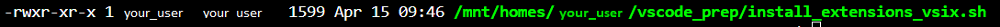
- If you cannot see the x you should change the permissions using `chmod +x install_extensions.sh`
- Run in your terminal: 
| IDE       | Command                                    |
|-----------|--------------------------------------------|
| vs code   | `bash install_extensions.sh vscode base`   |
| positron  | `bash install_extensions.sh positron base` |

- You will see **Installation completed** in your terminal. So, it means everything worked ok.
- You need to reload your vscode to make sure loading extensions. Press ctrl + shift + p and search Developer reload window
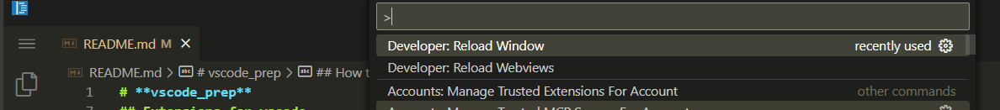
- (More extensions) There are some other extensions installers in this repo. One of them is jsoncrack. It would be installed from offline_installers folder because it was downloaded from the Official microsoft marketplace. This folder content is part of the bash script install_extensions.sh offline section bash file installer.

## Python venv creation
You can use venv (similar to renv in R) to create environments (private package container). 
- If you cloned vscode_prep, you should close vscode_prep and start from the main user path.
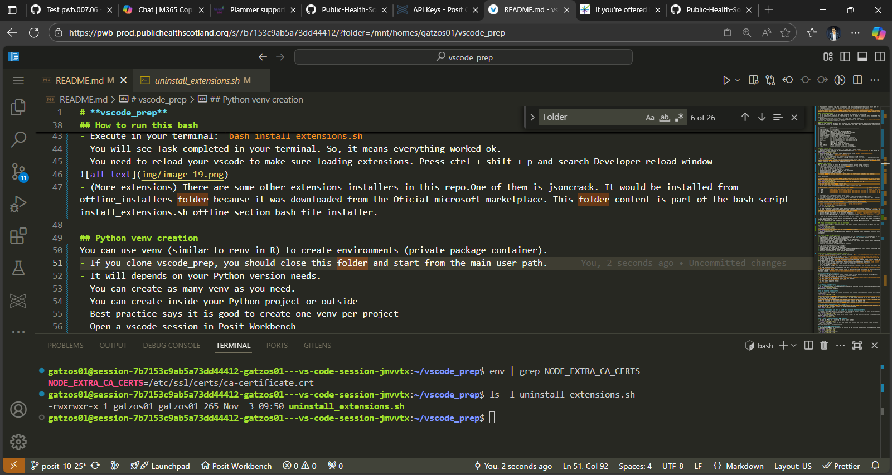
- You can create as many venv as you need and It depends on your Python version needs. 
- You can create inside your Python project or outside
- Best practice says it is good to create one venv per project
- Open a vscode session in Posit Workbench
- Open a terminal on vscode (ctrl + shift + ')
- Create a folder for your new project (e.g python_demo). Use the following command in your terminal:
```
mkdir python_demo
```
- Then you have to open your project folder using vs code/Positron. Go to the left hand menu and click on the explorer. You will see an Open Folder button. Click that button and you will see a dropdown list. You can click on your project folder (python_demo)

- You will see the complete path of your project folder and an OK button, click OK

- You will be in your project folder ready to work.
- You can choose one of these commands depending on your Python version need:

| Python Version | Command (virtual env outside Project Folder)                         | Command (Internal Project Folder)               |
|----------------|----------------------------------------------------------------------|-------------------------------------------------|
| 3.13.8         | `python -m venv /mnt/homes/your_user/.venv`                          | `python -m venv .venv`                          |
| 3.12.12        | `/opt/python/3.12.12/bin/python3 -m venv /mnt/homes/your_user/.venv` | `/opt/python/3.12.12/bin/python3 -m venv .venv` |
| 3.11.13        | `/opt/python/3.11.13/bin/python3 -m venv /mnt/homes/your_user/.venv` | `/opt/python/3.11.13/bin/python3 -m venv .venv` | 
| 3.10.19        | `/opt/python/3.10.19/bin/python3 -m venv /mnt/homes/your_user/.venv` | `/opt/python/3.10.19/bin/python3 -m venv .venv` | 

- This command will create an environment called .venv
- It is important to know Python versions end of support: https://devguide.python.org/versions/
- It's time to activate your personal virtual environment (venv). You need to activate it through the terminal. Open a terminal (Ctrl + Shift + `) if there isn’t one at the bottom of the VS Code/Positron interface.
- You need to remember you venv folder name, run one of these commands to activate it: 

| Command (virtual env outside Project Folder)     | Command (Internal Project Folder) |
|--------------------------------------------------|-----------------------------------|
| `source /mnt/homes/your_user/.venv/bin/activate` | `source .venv/bin/activate`       |
- You will see .venv as part of the terminal line


- You need to update your pip (Python package manager) which helps to download new packages: `pip install --upgrade pip wheel`
- You have 2 options to install required packages (make sure your python environment is already activated). Best practice says it is important to have requirements.txt file in every Python project folder.
- Create a requirements.txt file in your python_demo folder
- Option 1: Using a requirements.txt to facilitate the process: `pip install -r requirements.txt --prefer-binary`
- Option 2: Installing one package at time using the command in terminal: `pip install pandas==2.3.3 --prefer-binary`
    
    Note: If you don't activate your python environment you will probably install your package in the main Python installation.
    
- It is important to know packages versions for compatibility purposes, who develops this package (trusted sources) and how frequent they are updated: https://pypi.org/
- You should refresh your IDE to make sure your venv has been detected. Press ctrl + shift + p and search Developer reload window

### If you installed juputerlab in your own environment
- When you work with jupyter notebooks (.ipynb), make sure to click on the select kernel (dropdown right hand side) and choose your environment name.
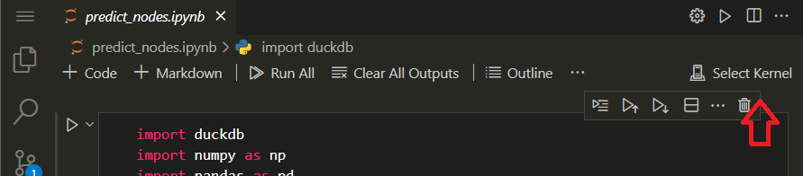
- Click on Python environments
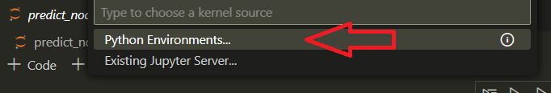
- Select your local .venv (in this case the project folder environment)

- If your project only have (.py) Python scripts, make sure to select the proper interpreter. Press ctrl + shift + p and search Python select interpreter

### Python packages in requirements.txt
These packages are the most popular and you can customise your own **requirements.tx**t file depending on your project needs.
- python-dotenv is useful when you want to separate sensitive data like usernames, password and others
- pandas is useful for data manipulation (dataframes)
- plotly is powerfull for data visualisation (bar, line and other plots)
- scikit-learn is useful for machine learning models (decision tree, random forest, support vector machine and others)
- pillow is needed when working with images
- jupyterlab is needed when working with Jupyter notebooks

You can install more packages later. For example:
- geopandas is powerfull when working with maps
- polars is faster than Pandas for large datasets
- ipywidgets helps to create controls in jupyter notebooks like dropdownlists, radio buttons, buttons and others
- duckdb is a powerfull embedded database for analytical purposes
- tensorflow is very popular for neural networks (deep learning)

## Alternative conda environments - only if you need it
- Use your vscode or R studio terminal to download miniconda: `wget -P /mnt/homes/your_user/ https://repo.anaconda.com/miniconda/Miniconda3-latest-Linux-x86_64.sh`
- Give execution permission to the script: `chmod +x /mnt/homes/your_user/Miniconda3-latest-Linux-x86_64.sh`
- Run the script file (Follow the installation steps): `bash /mnt/homes/your_user/Miniconda3-latest-Linux-x86_64.sh`
- Activate your base conda: `source /mnt/homes/your_user/miniconda3/bin/activate `
- You will be able to create your conda environment (you can directly add packages to the creation command). This command creates a conda environment called envtest: `conda create -n envtest python=3.11.9 pandas=2.2.3` or `conda create -n envtest python=3.11.9`
- You should activate your env (one of them). You will see your env name between parentheses: `conda activate envtest`
- You can install more packages (Your conda env must be activated): `conda install pandas=2.2.3`
- Check your packages: `conda list`
- You can use pip for packages which are not available via conda. You need to know your conda environment path using this command: `conda env list`
- You need to use your conda environment path like this: `/mnt/homes/your_user/miniconda3/envs/envtest/bin/pip install package_name==package_version`
- it would be similar if you want to run a py script in this specific conda environment. If your script is called demo.py you can use the following command: `/mnt/homes/your_user/miniconda3/envs/envtest/bin/python project_path/demo.py`

## **Git autocompletion in Terminal**
If you want to add git autocompletion command feature in your terminal you can follow the following steps:
- Open a terminal using ctrl + alt + ' (if there is no other opened)
- Run this command to download the feature script:
`curl -o ~/.git-completion.bash https://raw.githubusercontent.com/git/git/master/contrib/completion/git-completion.bash`
- Run this command to Add the feature to your user bash settings:
`echo "source ~/.git-completion.bash" >> ~/.bashrc`
- Run this code to apply the changes:
`source ~/.bashrc`

# **Frequently asked questions**
**Can I use question mark to ask about functions?**
- You can use question mark (?) and double question mark (??) after the function to get some informatio like this:
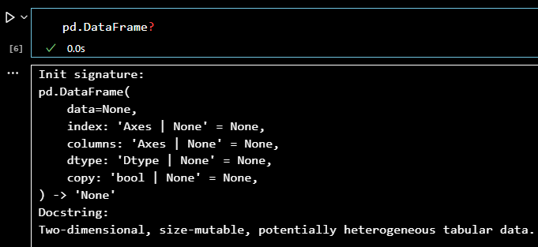
Only available in Jupyter notebooks

**How can I use the vscode-icons?**
- Go to the left hand side bar and click on extensions. Then, click on the vscode-icons, click on set file icon theme and finally click on VSCode icons.
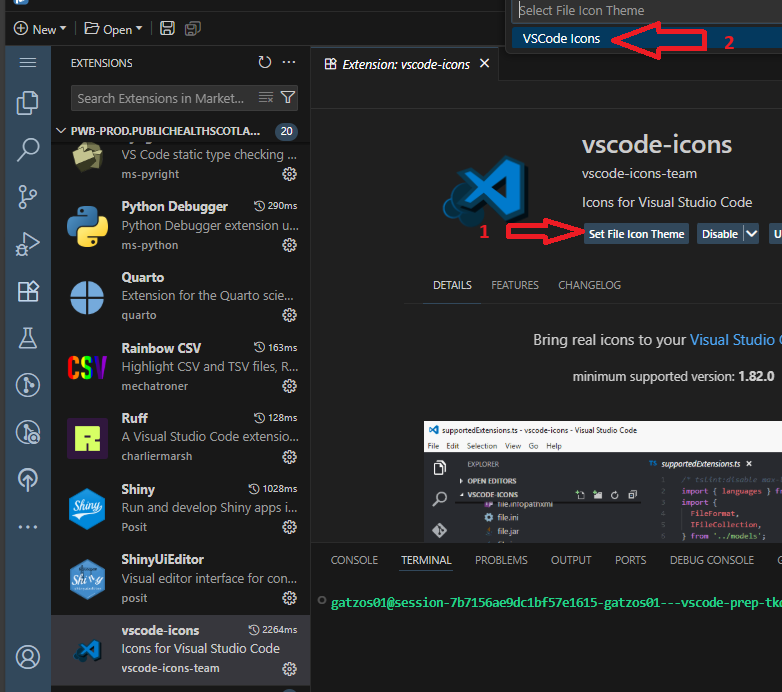

**How do I navigate to a folder on the stats drive to open a file?**
- It is easy if you create a shortcut (symbolic link). You need to open a terminal and run this command: ln -s /conf/my_path /mnt/homes/your_user/name_for_your_shortcut
- You must initialise your VSCode and go to the menu (top left) or simply press ctrl + k + o. I recommend opening a folder because projects need to be organised, and you can easily access all those files in the Explorer tab.
- If you have a venv you have to open your folder, open a terminal and activate your venv.

**How do I specify where I want to save a script?**
- If you previously opened a folder, you can add files in the same folder using the Explorer tab. There are two options (new folder and new file). You can add .py (normal scripts) or .ipynb (jupyter notebook).
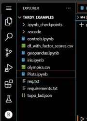

**Is there an environment like there is with R where I can see what I've created?**
- If you are running a .ipynb file extension you can use Jupyter variable windows. You should go to the menu (top left) and select terminal – new terminal. After that, you click on Jupyter variables tab.
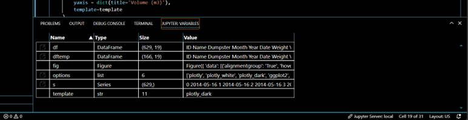
- You can use the extension code runner to run chunks of code. You need to select the lines of code and choose "run code" on the right-click menu or press ctrl + alt + n
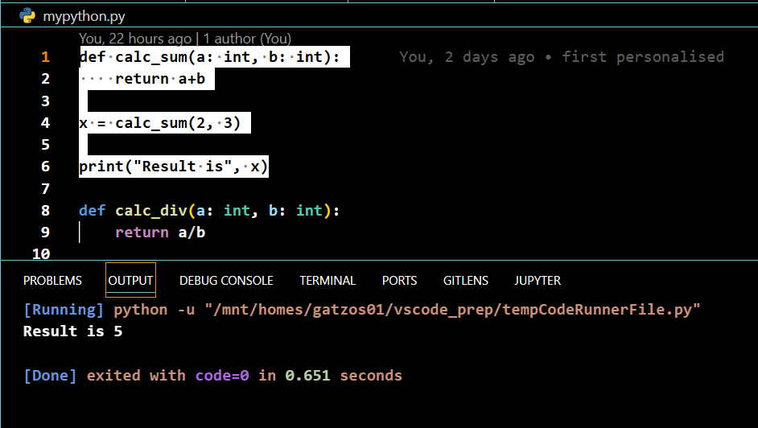

**Can I export a Jupyter notebook in HTML format?**
- Yes, you can. Press ctr + shift + p and search Export to html
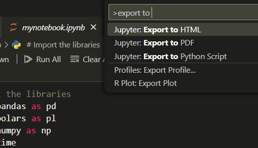
- If you are working with Plotly you will need to add these lines of code at the beginnin of your Notebook: 
`import plotly.io as pio
pio.renderers.default = 'notebook_connected'`

**How can I use JSON crack extension?**
- If you have a JSON file in your project and you can see the structure in a easy way, you neeed to open the file and go to the right-hand side corner. Press the JC icon:
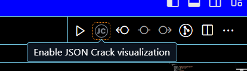
- You will have a result like this:
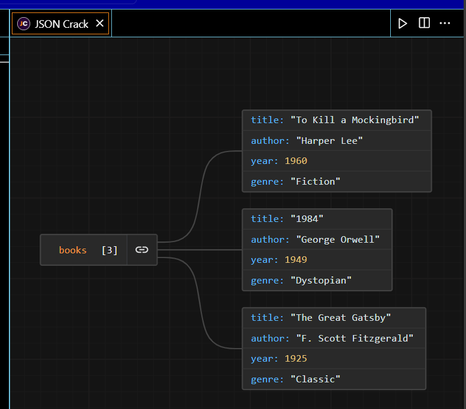

**How can I format my files?**
- Tou need to select all your code using `ctrl + a`
- Right clic and choose Format document with
- If it's a Python file, you will see the option "Ruff". Otherwise, you will see Prettier. 
- Clic on it and you will see your script being formatted.
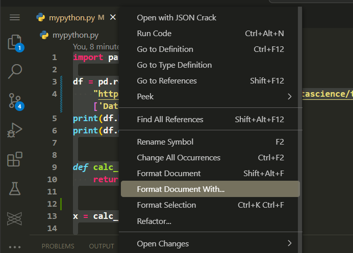
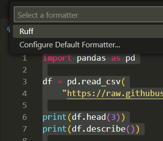

**How can I create a diagrama using draw.io?**
- You need to create a new file with the following extension .drawio.svg
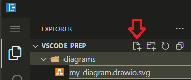
- If you already installed drawio extension you will be able to open that file
- You can find different icons. Search by words in the textbox
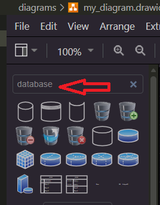
- You can add your diagraman to a README.md file like this:
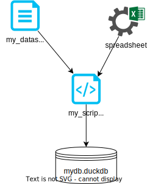
