# Prepare your VS Code / Positron for Python

[](https://github.com/Public-Health-Scotland/vscode_prep/tags)

This repository helps prepare VS Code (for Python and/or R) and the Posit IDE. These steps are compatible with Positron (2025.08.1, build 11).

## Prerequisites

- You need access to VS Code or Positron on your stats drive.
- It is recommended to work on your stats drive because you will have more space to install extensions and store projects.
- Create a symbolic link to your stats drive if you want to work easily with your files. Run this command in a terminal:

  `ln -s /conf/<your_folder_path> /mnt/homes/<your_username>/stats_link`

- You can change `stats_link` to any name you prefer. Replace `<your_folder_path>` and `<your_username>` with your information.

## 1. Clone this repo

- Launch a VS Code / Positron session and open a terminal using Ctrl+Shift+`.
- Navigate to your stats drive link:

  `cd stats_link`

  or

  `cd /mnt/homes/<your_username>/stats_link`

- Clone this repository:

  `git clone https://github.com/Public-Health-Scotland/vscode_prep.git`

- There are more useful GitHub commands in [GitHub/README.md](GitHub/README.md).
- Open the project folder in VS Code / Positron: click the Explorer icon, then choose Open Folder, select `stats_link`, then select the `vscode_prep` folder and click OK.

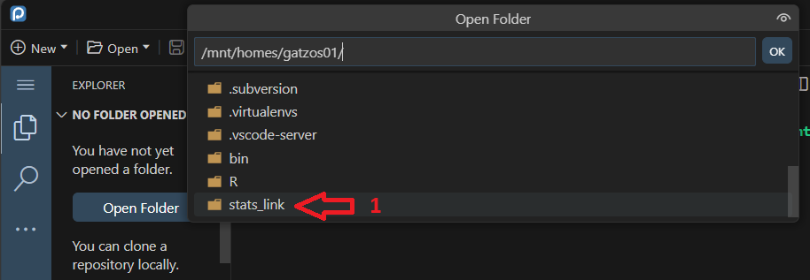

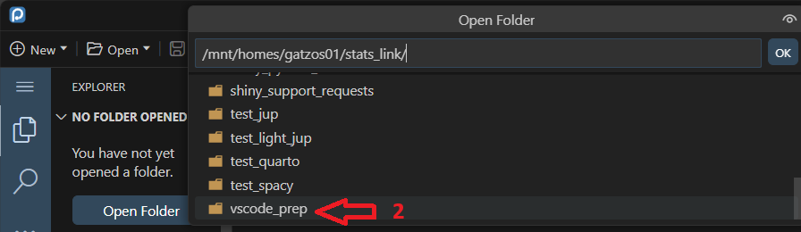

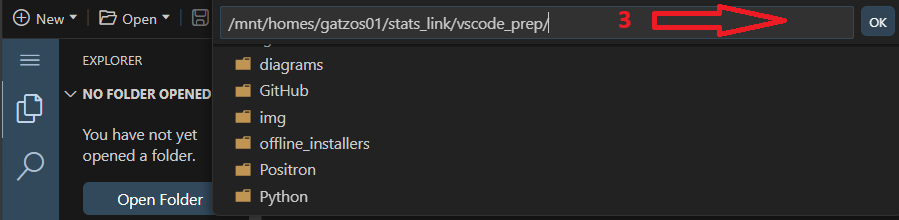

## 2. Clean old extensions

- You can skip this section if you have never installed extensions in your IDE.
- Open a terminal in VS Code / Positron (Ctrl+Shift+`).
- Use `uninstall_extensions.sh` from this repo to remove extensions; this is recommended if you've previously installed extensions.
- Make sure `uninstall_extensions.sh` has executable permissions. Run:

  `ls -l uninstall_extensions.sh`

  You should see an "x" in the permissions column.
- Execute the uninstall script for your IDE:

| IDE      | Command                                 |
|----------|-----------------------------------------|
| VS Code  | `bash uninstall_extensions.sh vscode`   |
| Positron | `bash uninstall_extensions.sh positron` |

- You should see **Extensions removal completed!** in your terminal when it finishes.

## Extensions for VS Code

The script `install_extensions.sh` automates extension installation; you can modify it for your needs. The most used extensions in the script include:

| Extension          | Description                                      |
|--------------------|--------------------------------------------------|
| ms-python.python   | Python language support                          |
| ms-python.debugpy  | Python debugger                                  |
| ms-pyright.pyright | Fast static type checker for Python              |
| quarto.quarto      | Support for Quarto documents and publishing      |
| autodocstring      | Automatically generate function docstrings       |
| ms-toolsai.jupyter | Jupyter Notebooks support                        |
| jupyter-renderers  | Improves plot support in notebooks               |
| prettier-vscode    | Formatter for many file types                    |
| rainbow-csv        | Makes CSV files easier to read                   |
| gitlens            | Provides Git history and repository insights     |
| code-runner        | Run code snippets from the editor                |
| Air - R            | Support for R language                           |
| shiny              | Support for Shiny projects                       |
| Ruff               | Fast Python linter and formatter                 |
| draw.io            | Create workflow diagrams                         |

## How to run the installer script

- Open a terminal in VS Code / Positron (Ctrl+Shift+`).
- Make sure `install_extensions.sh` has executable permissions:

  `ls -l install_extensions.sh`

  If you do not see an "x", make it executable:

  `chmod +x install_extensions.sh`

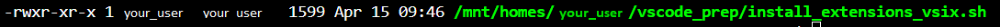

- Run the installer for your IDE:

| IDE      | Command                                    |
|----------|--------------------------------------------|
| VS Code  | `bash install_extensions.sh vscode base`   |
| Positron | `bash install_extensions.sh positron base` |

- You should see **Installation completed!** in the terminal if the installation succeeded.
- Reload VS Code / Positron to activate the installed extensions: open the Command Palette (Ctrl+Shift+P) and choose "Developer: Reload Window." 

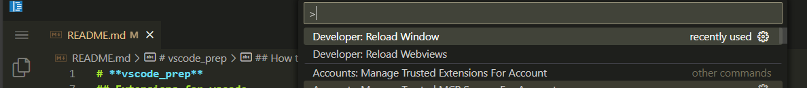

- Some installers are provided offline in `offline_installers/`, for example `jsoncrack`. Those are packaged for offline installation as part of the script.

## More guides

This repository also has other useful guides.

| Topic | Location | Description |
|-------|----------|-------------|
| Python | [View Python README](./Python/README.md) | How to create and use a virtual environment |
| Positron | [View Positron README](./Positron/README.md) | How to prepare the Positron IDE |
| Deployment | [View Deployment README](./Deployment/README.md) | Steps to deploy Shiny/Quarto projects to a server |
| GitHub | [View GitHub README](./GitHub/README.md) | How to use GitHub with VS Code / Positron |

# Frequently asked questions

**How can I use the VSCode icons?**

- Go to the Extensions view, open the VSCode Icons extension (Positron compatible), choose "Set File Icon Theme," and select "VSCode Icons."

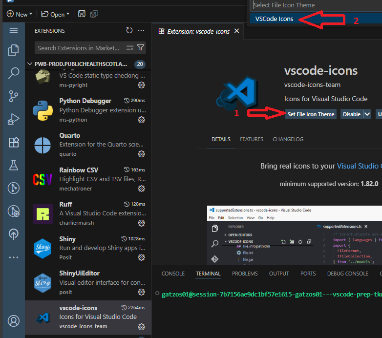

**How do I specify where to save a script?**

- If you have opened a folder, add files in the same folder using the Explorer tab (New File or New Folder). You can create `.py` files (scripts) or `.ipynb` files (Jupyter notebooks).

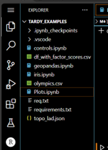

**Is there an environment like R where I can see what I've created?**

- For `.ipynb` files you can use the Jupyter Variables window. Open a terminal (Terminal → New Terminal) and then open the Jupyter Variables tab.

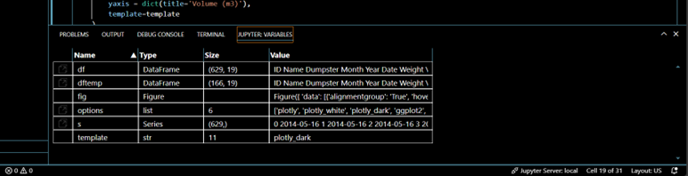

- Use the Code Runner extension (VS Code) to run code selections: select the lines, right-click and choose "Run Code" or press Ctrl+Alt+N.

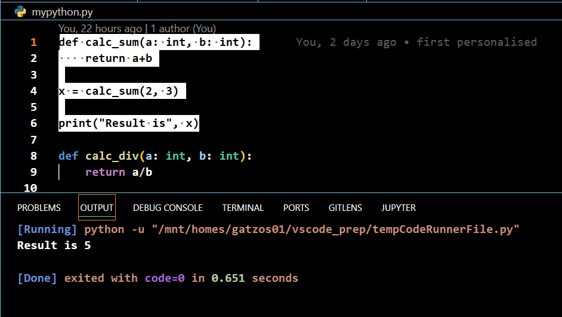

- In Positron you can use the Console pane. Select code and press Ctrl+Enter to run it in the console.

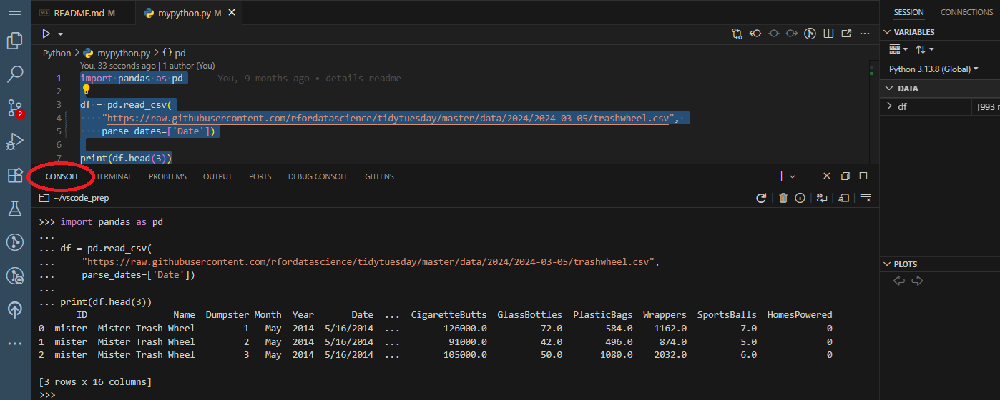

**Can I use question marks to inspect functions?**

- In Jupyter notebooks you can use `?` and `??` after a function name to view help and source (where supported).

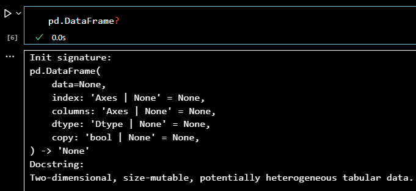

- In Positron you can use `?` and `??` in the Console tab.

**Can I export a Jupyter notebook to HTML?**

- Yes. Open the Command Palette (Ctrl+Shift+P) and run "Export to HTML." 

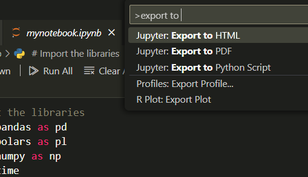

- If you use Plotly in notebooks, add these lines at the beginning of your notebook:

  ```python
  import plotly.io as pio
  pio.renderers.default = "notebook_connected"
  ```

**How can I use the JSON Crack extension?**

- Open a JSON file in the editor and click the JC icon in the top-right corner of the editor to view the structure.

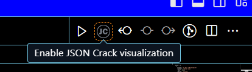

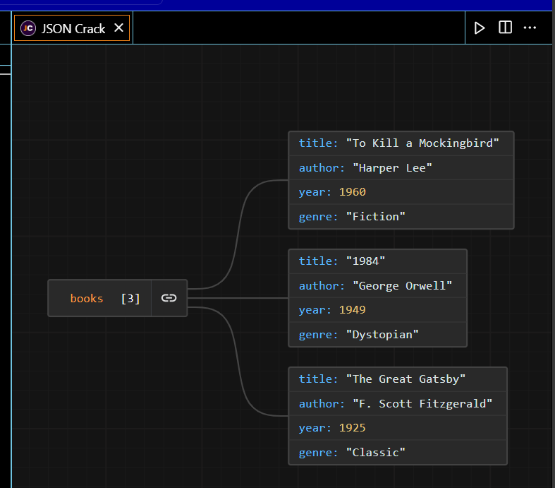

**How can I format my files?**

- Select all code with Ctrl+A.
- Right-click and choose "Format Document With..." For Python files you will see the option "Ruff"; for other files you will typically see "Prettier." Select the formatter to format the document.

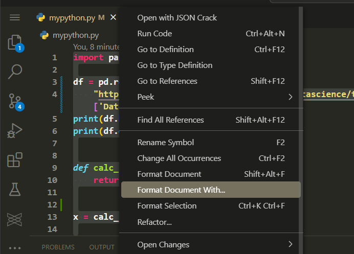

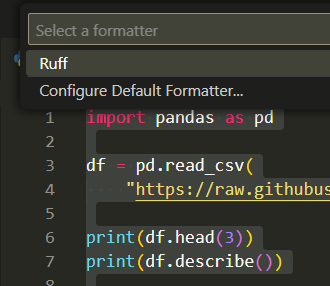

**How can I create a diagram using draw.io?**

- Create a new file with the `.drawio.svg` extension.

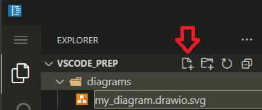

- If the draw.io extension is installed you can open and edit that file.
- Search the palette for icons and drag them onto the canvas.

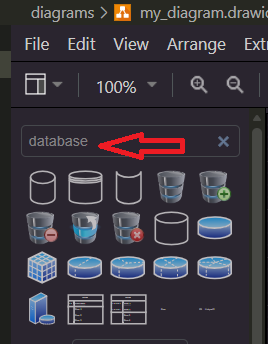

- You can embed a draw.io diagram in `README.md` like this:

  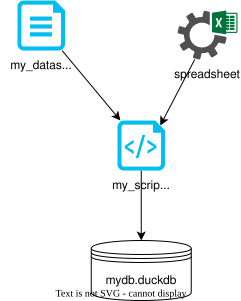
