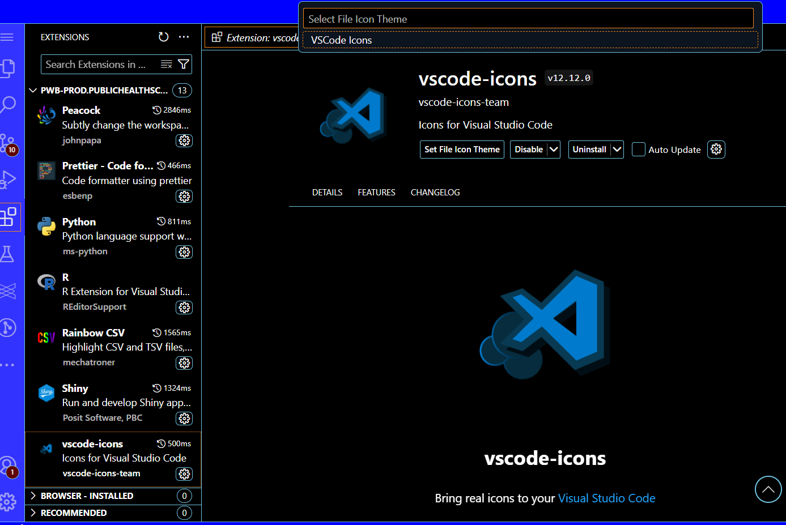

# **Prepare your VS Code/Positron for Python**

This repo helps to prepare your VS Code 1.102.0 (Python and/or R) in the new Posit. These steps are also compatible with Positron (2025.08.1 build 11).

## Pre requisites

-   You need to have access to VS Code or Positron in your stats drive.
-   It is important to **work on your stats drive** because you will have more space to install extensions and store your projects.
-   Create a symbolic link to your stats drive if you want to work easily with your files. You can do it using this command in a terminal: `ln -s /conf/<your_folder_path> /mnt/homes/<your_username>/stats_link`
-   You can change stats_link to any name you want. Don't forget to replace <your_folder_path> and <your_username> with your information.

## 1. Clone this repo

-   Launch a vs code/Positron session and open a terminal using ctrl + shift + '
-   Navigate to your stats drive link running this command: `cd stats_link` or `cd /mnt/homes/<your_username>/stats_link`
-   Clone this repo running this command: `git clone https://github.com/Public-Health-Scotland/vscode_prep.git`
-   There are more useful GitHub commands here [View GitHub Folder README](GitHub/README.md)
-   Then you have to open your project folder using vs code/Positron. Go to the left hand menu and click on the explorer icon. 
-   Click an Open Folder button. You will see a drop down list. You can click on stats_link, then click on vscode_prep folder and then click OK.

## 2. Clean old extensions

-   You can **skip** this section if you have **never installed** any **extensions** in your IDE
-   Open a terminal on vscode (ctrl + shift + ') if you haven't opened one yet.
-   You can use uninstall_extensions.sh from this repo in order to remove all extensions. It is recommended if you have previously installed extensions.
-   Make sure uninstall_extensions.sh has executable permissions, run this command: `ls -l uninstall_extensions.sh`. You should see "x" on the left hand side permissions file details section.
-   Execute in terminal depending on your IDE to uninstall all installed extensions:

| IDE      | Command                                 |
|----------|-----------------------------------------|
| vs code  | `bash uninstall_extensions.sh vscode`   |
| positron | `bash uninstall_extensions.sh positron` |

-   You will see **Extensions removal completed!** in your terminal.

## Extensions for vscode

There are some extensions which will help to improve your development experience. The script called “install_extensions.sh” will automate the installation process. You can modify this file depending on your needs. These are the most used extensions you can find in the script:

| Extension          | Description                                     |
|--------------------|-------------------------------------------------|
| ms-python.python   | Python support                                  |
| ms-python.debugpy  | Python debbuger                                 |
| ms-pyright.pyright | Fast static type checker for Python             |
| quarto.quarto      | Support for Quarto documents and publishing     |
| autodocstring      | autogenerate functions documentation            |
| ms-toolsai.jupyter | Jupyter Notebooks support                       |
| jupyter-renderers  | improves plot support in notebooks              |
| prettier-vscode    | Formatter for many type of files extensions     |
| rainbow-csv        | It helps to see your CSV files in a nicer way   |
| gitlens            | It gives you more details about you GitHub repo |
| code-runner        | It gives you more details about you GitHub repo |
| Air - R            | Support for R language                          |
| shiny              | Support for shiny projects                      |
| Ruff               | Fast Python linter and formatter                |
| shiny UIEditor     | Posit extension to blue print shiny apps.       |
| draw.io            | useful extension to create workflow diagrams    |

## How to run this bash

-   Open a terminal on vscode (ctrl + shift + ') if you haven't opened one yet.

-   Make sure “install_extensions.sh” has executable permissions `ls -l install_extensions.sh`. You should see "x" on the left hand side permissions file details section.

-   If you cannot see the x you should change the permissions using `chmod +x install_extensions.sh`

-   Run in your terminal:

| IDE      | Command                                    |
|----------|--------------------------------------------|
| vs code  | `bash install_extensions.sh vscode base`   |
| positron | `bash install_extensions.sh positron base` |

-   You will see **Installation completed!** in your terminal. So, it means everything worked ok.

-   You need to reload your vs code/Positron to make sure loading extensions. Press ctrl + shift + p and search Developer reload window

-   (More extensions) There are some other extensions installers in this repo. One of them is jsoncrack. It would be installed from offline_installers folder because it was downloaded from the Official microsoft marketplace. This folder content is part of the bash script install_extensions.sh offline section bash file installer.

## More guides

This repository also have other useful guides.

| Topic | Location | Description |
|----|----|----|
| Python | [View Python README](./Python/README.md) | How to create a virtual environment and use it |
| Positron | [View Positron README](./Positron/README.md) | How to prepare Positron IDE |
| GitHub | [View GitHub README](./GitHub/README.md) | How to use GitHub with vs code/Positron |

# **Frequently asked questions**

**How can I use the vscode-icons?**

-   Go to the left hand side bar and click on extensions. Then, click on the vscode-icons extension (Positron compatible), click on set file icon theme and finally click on VSCode icons.

**How do I specify where I want to save a script?**

-   If you previously opened a folder, you can add files in the same folder using the Explorer tab. There are two options (new folder and new file). You can add .py (normal scripts) or .ipynb (jupyter notebook).

**Is there an environment like there is with R where I can see what I've created?**

-   If you are running a .ipynb file extension you can use Jupyter variable windows. You should go to the menu (top left) and select terminal – new terminal. After that, you click on Jupyter variables tab.

-   You can use the extension code runner (VS code) to run chunks of code. You need to select the lines of code and choose "run code" on the right-click menu or press ctrl + alt + n

-   You can also use the console tab in Positron. Select the code you want to run and use ctrl + enter to run the code in the console tab.

**Can I use question mark to ask about functions?**

-   If you are using VS code (only with Jupyter notebooks files) you can use question mark (?) and double question mark (??) after the function to get some information like this:

-   If you are using Positron you can use ? and ?? after the function name in the console tab

**Can I export a Jupyter notebook in HTML format?**

-   Yes, you can. Press ctr + shift + p and search Export to html

-   If you are working with Plotly you will need to add these lines of code at the beginnin of your Notebook: `import plotly.io as pio pio.renderers.default = 'notebook_connected'`

**How can I use JSON crack extension?**

-   If you have a JSON file in your project and you can see the structure in a easy way, you neeed to open the file and go to the right-hand side corner. Press the JC icon:

-   You will have a result like this:

**How can I format my files?**

-   Tou need to select all your code using `ctrl + a`

-   Right click and choose Format document with - If it's a Python file, you will see the option "Ruff". Otherwise, you will see Prettier.

-   Click on it and you will see your script being formatted. {width="596"}

**How can I create a diagrama using draw.io?**

-   You need to create a new file with the following extension .drawio.svg

-   If you already installed drawio extension you will be able to open that file

-   You can find different icons. Search by words in the textbox

-   You can add your diagraman to a README.md file like this:

